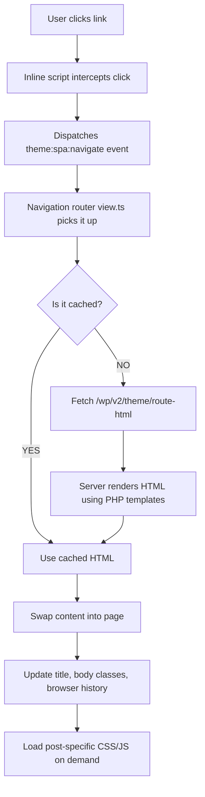

# Interactivity Theme

A WordPress theme that makes your site feel like a modern web app. Pages load instantly without full reloads, while keeping everything SEO-friendly and server-rendered.

Built with the WordPress Interactivity API and a custom SPA (Single Page Application) router.

## Performance: Before vs After

### Traditional WordPress (Before)

Every link click triggers a **full page reload**:

1. Browser requests a new HTML document
2. Re-downloads and re-parses CSS, JS, fonts, images
3. Re-renders the entire page (header, footer, sidebar, content)
4. Typical navigation: **800ms - 2s+** per page

### Interactivity Theme (After)

Link clicks only fetch the **content that changed**:

1. Browser fetches a small JSON response with just the new content HTML
2. Header, footer, sidebar, and styles stay in place
3. Only the content area swaps out
4. Typical navigation: **50ms - 200ms** per page

| Metric | Traditional WP | Interactivity Theme |
|--------|---------------|---------------------|
| Data per navigation | Full HTML document (~100-500 KB) | Content fragment (~5-50 KB) |
| CSS/JS re-parse | Every page load | Once (initial load only) |
| DOM re-render | Entire page | Content area only |
| Perceived load time | 800ms - 2s+ | 50ms - 200ms |
| Cached pages | None (browser cache only) | localStorage + server transients |
| SEO | Full SSR | Full SSR (identical) |

### How the Speed Works

1. **Client-side routing** -- Internal links are intercepted before the browser navigates. A lightweight fetch grabs server-rendered HTML from `/theme/route-html` and swaps it into the page.

2. **Two-layer caching** -- Archive and list pages are cached in `localStorage` for 5 minutes (up to 50 routes). The server also caches REST responses with WordPress transients. Single posts always fetch fresh so comments stay current.

3. **Minimal JavaScript** -- The SPA router is ~15 KB. Interactive blocks (accordion, search, counter) use the Interactivity API for partial hydration -- only the parts that need interactivity get JavaScript.

4. **Dynamic asset loading** -- When navigating to a post that uses special blocks or plugins, only the CSS/JS for that specific post is loaded on demand. No upfront bundle of every possible asset.

5. **Server rendering** -- All content comes from PHP templates. No client-side template building. Google sees the same HTML as your visitors.

## Features

- **Instant navigation** -- SPA-like routing with server-rendered HTML
- **Interactivity API** -- WordPress 6.5+ partial hydration for interactive blocks
- **4 custom blocks** -- Navigation (SPA router + responsive menu), Search (live REST API search), Counter, Accordion
- **WooCommerce compatible** -- Fixes the Order Attribution `CustomElementRegistry` conflict
- **Design tokens** -- CSS custom properties for easy theming (see [THEME-CUSTOMIZATION.md](THEME-CUSTOMIZATION.md))
- **Print styles** -- Clean print output with navigation/footer hidden
- **TypeScript** -- All block source code is typed

## Requirements

- WordPress 6.5+ (or Gutenberg 17.5+)
- PHP 7.4+
- Node.js 18+ (for building)

## Quick Start

```bash
# 1. Clone into your themes folder
cd wp-content/themes/

# 2. Install dependencies
cd interactivity-theme
npm install

# 3. Build block assets
npm run build

# 4. Activate in WordPress Admin > Appearance > Themes
```

For development with live rebuilds:

```bash
npm run dev
```

## How It Works

### SPA Navigation Flow



### REST Endpoints

| Endpoint | What it does |
|----------|-------------|
| `GET /wp/v2/theme/route-html?path=...` | Returns server-rendered HTML for any route |
| `GET /wp/v2/theme/global-styles` | Block editor + Customizer CSS for SPA injection |
| `GET /wp/v2/theme/post-assets?post_id=...` | CSS/JS handles needed for a specific post |
| `GET /wp/v2/theme/page-by-path?path=...` | Hierarchical page lookup by URL path |
| `GET /wp/v2/cached/posts` | Posts with server-side transient caching (5 min) |
| `GET /wp/v2/cached/pages` | Pages with server-side transient caching (5 min) |

### Template Hierarchy

| URL pattern | Template | Content partial |
|-------------|----------|----------------|
| Front page | `front-page.php` | Handles both "latest posts" and "static page" |
| Single post | `single.php` | `template-parts/route-single.php` |
| Page | `page.php` | `template-parts/route-page.php` |
| Archive / Home / Search | `index.php`, `archive.php`, `search.php` | `template-parts/route-loop.php` |

## File Structure

```
interactivity-theme/
├── style.css                  # Theme metadata + design tokens
├── print.css                  # Print-friendly styles
├── functions.php              # REST routes, caching, WooCommerce fix, SPA setup
├── front-page.php             # Front page (latest posts or static page)
├── index.php / archive.php / search.php / single.php / page.php
├── header.php / footer.php / sidebar.php / comments.php
├── template-parts/
│   ├── route-single.php       # Single post content (used by SPA + direct load)
│   ├── route-page.php         # Page content
│   └── route-loop.php         # Archive / home / search loop
├── blocks/                    # Block source (TypeScript + PHP)
│   ├── navigation/            # SPA router + responsive menu
│   │   ├── view.ts            # ~580 lines: routing, caching, asset injection
│   │   └── render.php         # Server-rendered menu markup
│   ├── search/                # Live search with REST API
│   ├── counter/               # Increment/decrement demo
│   └── accordion/             # Collapsible sections
├── build/blocks/              # Compiled output (generated)
├── types/wordpress.d.ts       # TypeScript declarations for wp global
├── tsconfig.json
├── webpack.config.js
├── package.json
├── phpcs.xml.dist             # WordPress Coding Standards config
├── THEME-CUSTOMIZATION.md     # Design token reference
└── README.md
```

## Linting

```bash
npm run lint          # Run all linters
npm run lint:php      # PHP (WordPress Coding Standards via PHPCS)
npm run lint:php:fix  # Auto-fix PHP issues
npm run lint:js       # TypeScript/JavaScript (ESLint)
npm run lint:js:fix   # Auto-fix JS issues
npm run lint:css      # CSS (stylelint)
```

PHP linting requires Composer: `composer install`

## Customization

Override CSS design tokens in a child theme or the Customizer's Additional CSS:

```css
:root {
    --theme-color-primary: #2563eb;
    --theme-color-bg: #fafafa;
    --theme-container-max: 960px;
}
```

Full token reference: [THEME-CUSTOMIZATION.md](THEME-CUSTOMIZATION.md)

## Troubleshooting

| Problem | Fix |
|---------|-----|
| Blank content on refresh | Make sure `template-parts/route-page.php`, `route-single.php`, `route-loop.php` exist |
| Stale content after SPA nav | Clear `localStorage` key `theme_route_cache` |
| WooCommerce `CustomElementRegistry` error | Theme auto-dequeues the script on non-checkout pages -- check `functions.php` is active |
| Blocks not in editor | Run `npm install && npm run build`, verify WP 6.5+ |

## Author

**Aris** -- [madebyaris.com](https://madebyaris.com)

- GitHub: [@madebyaris](https://github.com/madebyaris)
- X: [@arisberikut](https://x.com/arisberikut)
- LinkedIn: [arissetia](https://www.linkedin.com/in/arissetia/)

## License

GNU General Public License v2 or later
