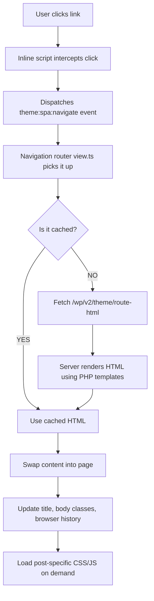

# Interactivity Theme

[](https://www.gnu.org/licenses/gpl-2.0.html)
[](https://wordpress.org)
[](https://php.net)
[](https://woocommerce.com)

**A WordPress theme that makes your site feel like a modern web app.** Pages load instantly without full reloads, while keeping everything SEO-friendly and server-rendered.

*Built with the WordPress Interactivity API and a custom SPA (Single Page Application) router.*

[Quick Start](#quick-start) | [Features](#features) | [How It Works](#how-it-works) | [Roadmap](#roadmap) | [File Structure](#file-structure) | [Contributing](#contributing)

---

## Features

- **Instant navigation** — SPA-like routing with server-rendered HTML
- **Interactivity API** — WordPress 6.5+ partial hydration for interactive blocks
- **4 custom blocks** — Navigation (SPA router + responsive menu), Search (live REST API search), Counter, Accordion
- **WooCommerce compatible** — Full theme support, product gallery, blocks, shop sidebar; cart/checkout/my-account use full page load; fixes Order Attribution `CustomElementRegistry` conflict
- **Design tokens** — CSS custom properties for easy theming (see [THEME-CUSTOMIZATION.md](THEME-CUSTOMIZATION.md))
- **Print styles** — Clean print output with navigation/footer hidden
- **TypeScript** — All block source code is typed

### Philosophy

The theme combines SPA-style instant navigation with full server-side rendering. You get the perceived speed of a client-side app without sacrificing SEO or the reliability of PHP templates. Content is always server-rendered; the SPA layer only swaps HTML fragments on navigation.

---

## Requirements

- WordPress 6.5+ (or Gutenberg 17.5+)
- PHP 7.4+
- Node.js 18+ (for building)

---

## Quick Start

```bash
# 1. Clone into your themes folder
cd wp-content/themes/

# 2. Install dependencies
cd interactivity-theme
npm install

# 3. Build block assets
npm run build

# 4. Activate in WordPress Admin > Appearance > Themes
```

For development with live rebuilds:

```bash
npm run dev
```

---

## Performance: Before vs After

### Traditional WordPress (Before)

Every link click triggers a **full page reload**:

1. Browser requests a new HTML document
2. Re-downloads and re-parses CSS, JS, fonts, images
3. Re-renders the entire page (header, footer, sidebar, content)
4. Typical navigation: **800ms - 2s+** per page

### Interactivity Theme (After)

Link clicks only fetch the **content that changed**:

1. Browser fetches a small JSON response with just the new content HTML
2. Header, footer, sidebar, and styles stay in place
3. Only the content area swaps out
4. Typical navigation: **50ms - 200ms** per page

| Metric | Traditional WP | Interactivity Theme |
|--------|---------------|---------------------|
| Data per navigation | Full HTML document (~100-500 KB) | Content fragment (~5-50 KB) |
| CSS/JS re-parse | Every page load | Once (initial load only) |
| DOM re-render | Entire page | Content area only |
| Perceived load time | 800ms - 2s+ | 50ms - 200ms |
| Cached pages | None (browser cache only) | localStorage + server transients |
| SEO | Full SSR | Full SSR (identical) |

### How the Speed Works

1. **Client-side routing** — Internal links are intercepted before the browser navigates. A lightweight fetch grabs server-rendered HTML from `/theme/route-html` and swaps it into the page.

2. **Two-layer caching** — Archive and list pages are cached in `localStorage` for 5 minutes (up to 50 routes). The server also caches REST responses with WordPress transients. Single posts always fetch fresh so comments stay current.

3. **Minimal JavaScript** — The SPA router is ~15 KB. Interactive blocks (accordion, search, counter) use the Interactivity API for partial hydration — only the parts that need interactivity get JavaScript. Cart, checkout, and my-account use full page loads for reliability.

4. **Dynamic asset loading** — When navigating to a post that uses special blocks or plugins, only the CSS/JS for that specific post is loaded on demand. No upfront bundle of every possible asset.

5. **Server rendering** — All content comes from PHP templates. No client-side template building. Google sees the same HTML as your visitors.

---

## How It Works

### SPA Navigation Flow



### REST Endpoints

| Endpoint | What it does |
|----------|-------------|
| `GET /wp/v2/theme/route-html?path=...` | Returns server-rendered HTML for any route |
| `GET /wp/v2/theme/global-styles` | Block editor + Customizer CSS for SPA injection |
| `GET /wp/v2/theme/post-assets?post_id=...` | CSS/JS handles needed for a specific post |
| `GET /wp/v2/theme/page-by-path?path=...` | Hierarchical page lookup by URL path |
| `GET /wp/v2/cached/posts` | Posts with server-side transient caching (5 min) |
| `GET /wp/v2/cached/pages` | Pages with server-side transient caching (5 min) |

### Template Hierarchy

| URL pattern | Template | Content partial |
|-------------|----------|----------------|
| Front page | `front-page.php` | Handles both "latest posts" and "static page" |
| Single post | `single.php` | `template-parts/route-single.php` |
| Page | `page.php` | `template-parts/route-page.php` |
| Archive / Home / Search | `index.php`, `archive.php`, `search.php` | `template-parts/route-loop.php` |
| Shop / Product / Product archive | `woocommerce.php` | WooCommerce content; cart/checkout/my-account use `page.php` (full page load) |

---

## Roadmap

Planned features and improvements, prioritized by impact:

| Priority | Category | Items |
|----------|----------|-------|
| **P1 (Critical)** | Accessibility & Fixes | Skip-to-content, focus trap in search overlay, `aria-live` for SPA content, `prefers-reduced-motion`, fix search block `postType`/`maxResults` |
| **P2 (Features)** | New Features | Breadcrumbs, Open Graph/Twitter Cards, JSON-LD, dark mode, related posts, TOC block, mini-cart, infinite scroll |
| **P3 (Improvements)** | UX & Performance | Responsive breakpoints, SPA error handling, loading skeleton, responsive images, lazy loading, cache invalidation, dynamic WooCommerce paths |
| **P4 (Code Quality)** | Dev Experience | Unit tests, E2E tests, constants extraction, i18n, navigation block editor, service worker |

Implementation follows phased rollout: Phase 1 (P1) → Phase 2 (P2) → Phase 3 (P3) → Phase 4 (P4).

---

## Key Design Decisions

### Why SPA + SSR?

Instant feel without sacrificing SEO. Content is always server-rendered; the SPA layer only swaps HTML fragments on navigation. Search engines and users without JavaScript see the same full HTML.

### Why Skip SPA for Cart/Checkout?

Reliability and compatibility with WooCommerce flows. Cart, checkout, and my-account use full page loads to avoid conflicts with payment gateways, session handling, and order attribution scripts.

### Why localStorage + Transients?

Two-layer caching: archives and list pages are cached in `localStorage` (5 min, up to 50 routes) for fast repeat visits; the server caches REST responses with transients. Single posts always fetch fresh so comments stay current.

---

## File Structure

```
interactivity-theme/
├── style.css                  # Theme metadata + design tokens
├── print.css                  # Print-friendly styles
├── functions.php              # REST routes, caching, WooCommerce support, SPA setup
├── front-page.php             # Front page (latest posts or static page)
├── index.php / archive.php / search.php / single.php / page.php
├── woocommerce.php            # Shop, product archives, single product
├── header.php / footer.php / sidebar.php / sidebar-shop.php / comments.php
├── template-parts/
│   ├── route-single.php       # Single post content (used by SPA + direct load)
│   ├── route-page.php        # Page content
│   └── route-loop.php        # Archive / home / search loop
├── blocks/                    # Block source (TypeScript + PHP)
│   ├── navigation/            # SPA router + responsive menu
│   │   ├── view.ts            # Routing, caching, asset injection, SPA skip for WooCommerce
│   │   └── render.php         # Server-rendered menu markup
│   ├── search/                # Live search with REST API
│   ├── counter/               # Increment/decrement demo
│   └── accordion/             # Collapsible sections
├── build/blocks/              # Compiled output (generated)
├── types/wordpress.d.ts       # TypeScript declarations for wp global
├── tsconfig.json
├── webpack.config.js
├── package.json
├── phpcs.xml.dist             # WordPress Coding Standards config
├── THEME-CUSTOMIZATION.md     # Design token reference
└── README.md
```

---

## Linting

```bash
npm run lint          # Run all linters
npm run lint:php      # PHP (WordPress Coding Standards via PHPCS)
npm run lint:php:fix  # Auto-fix PHP issues
npm run lint:js       # TypeScript/JavaScript (ESLint)
npm run lint:js:fix   # Auto-fix JS issues
npm run lint:css      # CSS (stylelint)
```

PHP linting requires Composer: `composer install`

---

## Customization

Override CSS design tokens in a child theme or the Customizer's Additional CSS. Full token reference: [THEME-CUSTOMIZATION.md](THEME-CUSTOMIZATION.md)

---

## Troubleshooting

| Problem | Fix |
|---------|-----|
| Blank content on refresh | Make sure `template-parts/route-page.php`, `route-single.php`, `route-loop.php` exist |
| Stale content after SPA nav | Clear `localStorage` key `theme_route_cache` |
| WooCommerce `CustomElementRegistry` error | Theme auto-dequeues order-attribution script on non-checkout pages -- check `functions.php` is active |
| `wp-interactivity` not registered | Run `npm run build`; theme uses ES modules with `@wordpress/interactivity` dependency |
| Blocks not in editor | Run `npm install && npm run build`, verify WP 6.5+ |

---

## Contributing

1. Star this repo
2. Fork & create a branch
3. Follow existing code style (PHPCS, ESLint)
4. Test with WordPress 6.5+ and WooCommerce
5. Submit a PR

---

## References

- [WordPress Interactivity API](https://developer.wordpress.org/block-editor/reference-guides/interactivity-api/)
- [WooCommerce Theme Development](https://woocommerce.com/document/woocommerce-theme-developer-documentation/)
- [Block Editor Handbook](https://developer.wordpress.org/block-editor/)

---

## Author

**Aris** — [madebyaris.com](https://madebyaris.com)

- GitHub: [@madebyaris](https://github.com/madebyaris)
- X: [@arisberikut](https://x.com/arisberikut)
- LinkedIn: [arissetia](https://www.linkedin.com/in/arissetia/)

## License

GNU General Public License v2 or later

---

*Made with care by [Aris Setiawan](https://github.com/madebyaris)*
